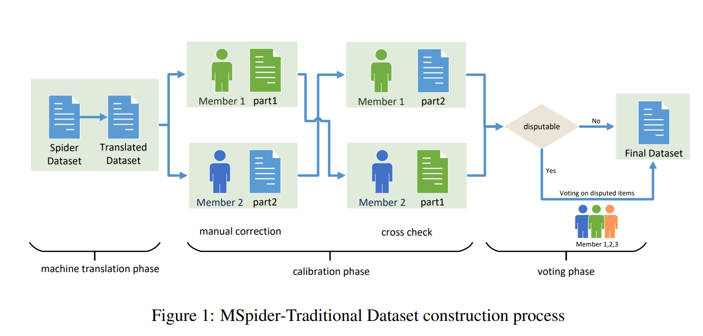
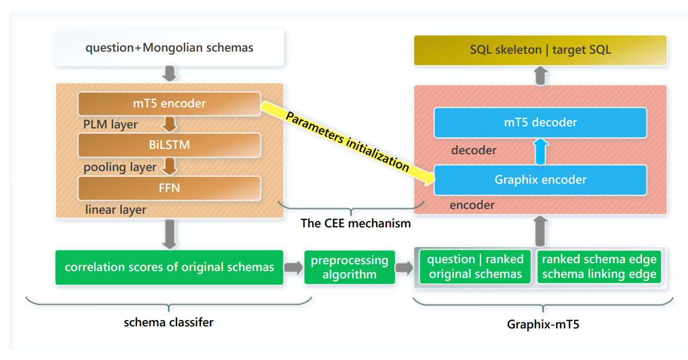

# mon2sql:

## Dataset
### Construction process

### Details of dataset segmentation
Segmentation of the dataset according to CSpider segmentation

| Dataset    | Train set | Dev set | Test set | Total |
|------------|-----------|---------|----------|-------|
| MSpider-T  | 6831      | 954     | 1908     | 9693  |
| Spider-R   | 6831      | 954     | 1908     | 9693  |

## RPG+CEE

Figure 2 illustrates the structure of the RPG+CEE
We have uploaded the original code and are currently further organizing it

Table 1 Results on MSpider-T

| Model                          | Dev EM          | Dev EX          | Test EM         | Test EX         |
|--------------------------------|-----------------|-----------------|-----------------|-----------------|
| SC+Qwen 2.5 (0-shot)           | 0               | 11.63           | 0               | 24.08           |
| SC+DeepSeek-Coder (0-shot)     | 0.10            | 10.06           | 0               | 20.35           |
| mT5-Large                      | 36.68           | 48.11           | 24.76           | 44.28           |
| Graphix-mT5-Large              | 41.92           | 54.08           | 29.27           | 51.36           |
| RESDSQL-mT5-Large              | 44.44           | 58.59           | 29.22           | 55.40           |
| RESDSQL+CEE-mT5-Large          | 46.43 (+1.99)   | 58.49 (-0.1)    | 30.84 (+1.62)   | 57.55 (+2.15)   |
| RPG-mT5-Large                  | 44.33 (-0.11)   | 58.70 (+0.11)   | 29.40 (+0.18)   | 55.71 (+0.31)   |
| RPG+CEE-mT5-Large              | 49.58 (+5.14)   | 61.84 (+3.25)   | 31.42 (+2.20)   | 58.02 (+2.62)   |

Table 2:Results on Spider-R

| Model                          | Dev EM          | Dev EX          | Test EM         | Test EX         |
|--------------------------------|-----------------|-----------------|-----------------|-----------------|
| SC+Qwen 2.5 (0-shot)           | 25.26           | 42.03           | 22.95           | 50.68           |
| SC+DeepSeek-Coder (0-shot)     | 20.33           | 41.09           | 20.38           | 47.22           |
| mT5-Large                      | 74.10           | 79.55           | 58.85           | 69.39           |
| Graphix-mT5-Large              | 76.62           | 80.50           | 59.43           | 70.80           |
| RESDSQL-mT5-Large              | 79.55           | 85.01           | 60.22           | 77.25           |
| RESDSQL+CEE-mT5-Large          | 80.50 (+0.95)   | 85.42 (+0.41)   | 62.05 (+1.83)   | 77.25           |
| RPG+CEE-mT5-Large (WQ)         | 79.45 (-0.1)    | 80.29 (-4.72)   | 59.64 (-0.58)   | 69.18 (-8.07)   |
| RPG+CEE-mT5-Large              | 80.81 (+1.26)   | 81.23 (-3.78)   | 61.11 (+0.89)   | 70.33 (-6.92)   |
